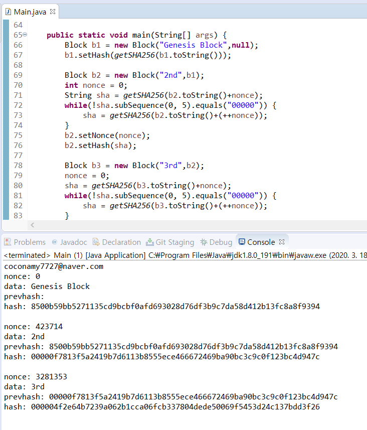

# 블록체인구현

#### SHA256을 이용한 암호화 출력화면




#### 소스코드

```
import java.security.MessageDigest;
import java.security.NoSuchAlgorithmException;

class Block {
	int nonce;
	Block prevhash;
	String hash;
	String data;
	
	public Block(String data, Block pre) {
		
		this.nonce = 0;
		this.data = data;
		this.prevhash = pre;
	}

	public int getNonce() {
		return nonce;
	}

	public void setNonce(int nonce) {
		this.nonce = nonce;
	}

	public Block getPrevhash() {
		return prevhash;
	}

	public void setPrevhash(Block prevhash) {
		this.prevhash = prevhash;
	}

	public String getHash() {
		return hash;
	}

	public void setHash(String hash) {
		this.hash = hash;
	}

	public String getData() {
		return data;
	}

	public void setData(String data) {
		this.data = data;
	}
	
	public String toString() {
		if (this.prevhash==null) {
			return this.data+this.nonce;
		}
		return this.prevhash.getHash()+this.data;
	}
	
	public String printAns() {
		if (this.prevhash==null) {
			return "nonce: "+this.nonce+"\ndata: "+this.data+"\nprevhash: \nhash: "+this.hash;
		}
		return "nonce: "+this.nonce+"\ndata: "+this.data+"\nprevhash: "+this.prevhash.getHash()+"\nhash: "+this.hash;
	}
}
public class Main {
	
	public static void main(String[] args) {
		Block b1 = new Block("Genesis Block",null);
		b1.setHash(getSHA256(b1.toString()));
		
		Block b2 = new Block("2nd",b1);
		int nonce = 0;
		String sha = getSHA256(b2.toString()+nonce);
		while(!sha.subSequence(0, 5).equals("00000")) {
			sha = getSHA256(b2.toString()+(++nonce));
		}
		b2.setNonce(nonce);
		b2.setHash(sha);
		
		Block b3 = new Block("3rd",b2);
		nonce = 0;
		sha = getSHA256(b3.toString()+nonce);
		while(!sha.subSequence(0, 5).equals("00000")) {
			sha = getSHA256(b3.toString()+(++nonce));
		}
		b3.setNonce(nonce);
		b3.setHash(sha);
		
		System.out.println("coconamy7727@naver.com");
		System.out.println(b1.printAns()+"\n");
		System.out.println(b2.printAns()+"\n");
		System.out.println(b3.printAns()+"\n");
		
	}
	
	public static String getSHA256(String str){

		String SHA = ""; 
		try{

			MessageDigest sh = MessageDigest.getInstance("SHA-256"); 
			sh.update(str.getBytes()); 
			byte byteData[] = sh.digest();
			StringBuffer sb = new StringBuffer(); 
			for(int i = 0 ; i < byteData.length ; i++){
				sb.append(Integer.toString((byteData[i]&0xff) + 0x100, 16).substring(1));
			}
			SHA = sb.toString();
		}catch(NoSuchAlgorithmException e){
			e.printStackTrace(); 
			SHA = null; 
		}
		return SHA;

	}

}

```

