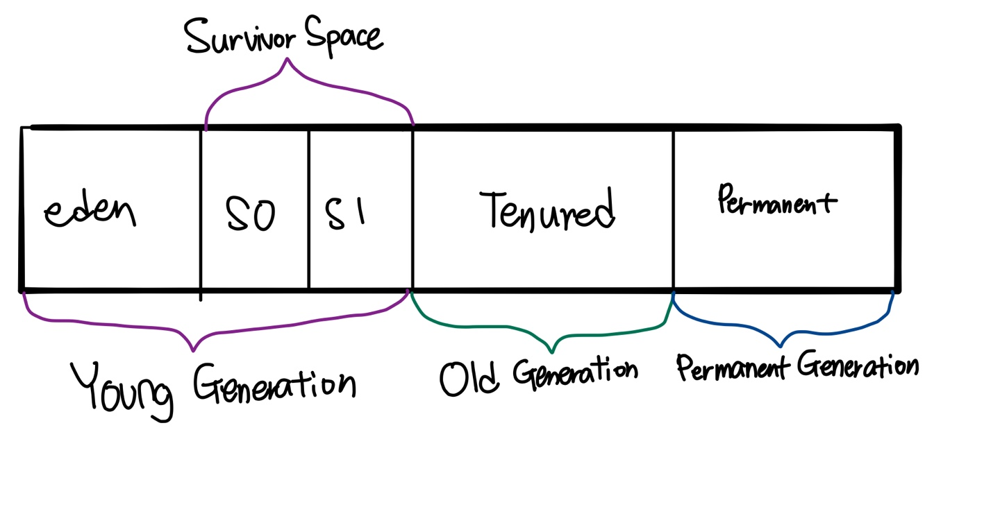

# Java Virtual Machine

- 운영체제 독립적, 자동으로 메모리 관리(gc), 안정적

### JVM 구조

- Java의 컴파일러가 자바의 소스코드(.java 파일)를 빌드하면 바이트코드 파일(.class 파일)이 생성된다.
- Class Loader
  - Jvm의 Class Loader가 이 바이트 코드 파일을 Runtime Data Areas에 로딩하여 프로그램을 구동한다.
- Execution Engine
  - Class Loader가 Runtime Data Areas에 불러온 바이트코드를 기계어로 변경해 명령어 단위(opcode와 피연산자로 구성)로 실행한다.
- Garbage Collector
  - Heap 영역에서 참조되지 않는 오브젝트를 제거하는 역할
- Runtime Data Areas
  - OS로부터 할당받은 JVM의 메모리 영역으로, 자바 애플리케이션을 실행하는데 필요한 데이터를 담는다.
  - Method
    - Class Loader가 적재한 클래스(또는 인터페이스)에 대한 메타데이터 정보가 저장된다.
  - Heap
    - new 연산자로 생성된 객체를 저장하는 공간이며, 참조하는 변수나 필드가 존재하지 않으면 GC의 대상이 된다.
  - Stack
    - Thread마다 별개의 Frame으로 저장하며, Local Variable(지역변수, 매개변수, 메소드를 호출한 주소 등 Method 수행 중 발생하는 임시데이터), Operand Stack, Frame Data를 저장한다. 
  - PC(Program Counter) Register
    - Thread가 현재 실행하고 있는 부분의 주소를 저장한다.
  - Native Method Stack
    - 자바 외 언어(C/ C++ 등)로 작성된 네이티브 코드를 위한 메모리 영역이다. 
  - Method, Heap영역은 모든 Thread가 공유하는 영역이고, 나머지는 각 Thread마다 존재하는 영역이다.

## Garbage Collection

- Garbage Collector(GC)는 Heap 메모리에서 참조되지 않는 객체를 식별하여 메모리에서 삭제하는 기능이다. 

### GC Steps

1. Marking

   - 메모리 중 어떤 부분이 사용되지 않고 있는지 체크하는 단계
     - 모든 메모리를 체크 해야한다면 GC에게 부담이 되므로, JVM은 세대별로 메모리를 구분하여 GC를 따로 적용한다.

2. Normal Deletion

   - Marking으로 찾아낸 비참조 객체를 삭제하는 단계
   - 삭제 후에 생기는 빈 공간은 Memory Allocator가 참조하고 있어서, 메모리를 할당해야 할 일이 생기면, 빈 공간을 찾아준다.

3. Deletion with Compacting

   - 빈 공간을 합치기 위해 메모리를 이동하는 것

   - GC 수행 후 효율적이고 빠른 메모리 사용을 위해 Compaction을 고려할 수 있다.

### Generational GC

JVM의 성능을 향상할 수 있는 방법으로, 세대별로 메모리를 나누어 GC를 적용하는 방법을 채택했다. 

- Young Generation
  - 객체가 생성되면 Eden 영역에 생성된다. Eden 영역이 꽉차게되면 **Minor GC**가 발생한다. Minor GC에서 살아남은 객체는 Survivor 영역 중 하나로 이동한다. Minor GC가 발생할때마다 살아남은 객체의 Age가 증가하는데, Age가 임계치를 넘은 객체는 Old 영역으로 이동하게 된다.
- Old Generation
  - Old 영역은 가득차게 되면 **Major GC**가 발생한다. Major GC는 보통 Minor GC보다 훨씬 느린데, 그 이유는 Young 영역을 제외한 모든 살아있는 객체를 검사해야하기 때문이다.
- Permanent Generation
  - Permanent 영역은 클래스와 메서드의 메타데이터(데이터에 관한 구조화된 데이터로, 다른 데이터를 설명해 주는 데이터)가 저장되는 공간이다.
  - Permanent 영역의 크기가 모자르다면, GC는 적재된 클래스를 수집하게 된다. 이떄의 GC는 Full GC.

### Garbage Collector Process

1. 객체가 생성되면 Eden영역에 할당
2. Eden 영역이 가득차게되면 **Minor GC**가 실행
3. 이후에 Eden영역에 남아있는 객체는 Survivor영역 중 하나로 옮겨지고(**S0, S1 영역을 번갈아가며 사용**), Eden 영역은 완전히 비어있는 상태
4. Minor GC의 반복, 이 때, 살아있는 객체들은 각자 Age를 가지고 있는데, **Minor GC가 발생할 때마다 살아있는 객체 각자의 Age가 1씩 증가**
5. **Minor GC가 반복되고 객체들의 Age가 증가하여 임계값(threshold)을 넘어가면 Old 영역으로 이동**
6. Old 영역(Tenured)이 가득차게 되면 **Major GC**가 발생

