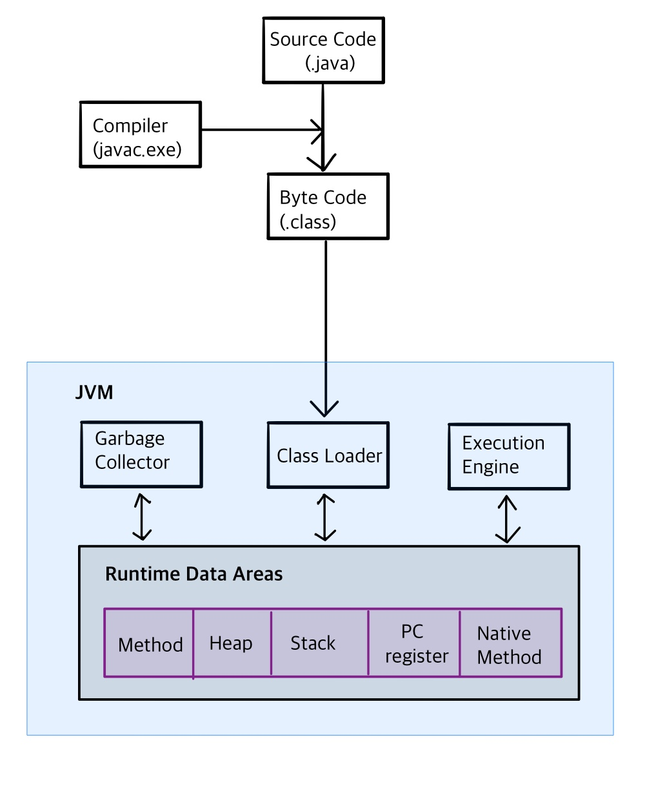

# Java Virtual Machine

- 운영체제 독립적, 자동으로 메모리 관리(gc), 안정적

### JVM 구조

- Java의 컴파일러가 자바의 소스코드(.java 파일)를 빌드하면 바이트코드 파일(.class 파일)이 생성된다.
- Class Loader
  - Jvm의 Class Loader가 이 바이트 코드 파일을 Runtime Data Areas에 로딩하여 프로그램을 구동한다.
- Execution Engine
  - Class Loader가 Runtime Data Areas에 불러온 바이트코드를 기계어로 변경해 명령어 단위(opcode와 피연산자로 구성)로 실행한다.
- Garbage Collector
  - Heap 영역에서 참조되지 않는 오브젝트를 제거하는 역할
- Runtime Data Areas
  - OS로부터 할당받은 JVM의 메모리 영역으로, 자바 애플리케이션을 실행하는데 필요한 데이터를 담는다.
  - Method
    - Class Loader가 적재한 클래스(또는 인터페이스)에 대한 메타데이터 정보가 저장된다.
  - Heap
    - new 연산자로 생성된 객체를 저장하는 공간이며, 참조하는 변수나 필드가 존재하지 않으면 GC의 대상이 된다.
  - Stack
    - Thread마다 별개의 Frame으로 저장하며, Local Variable(지역변수, 매개변수, 메소드를 호출한 주소 등 Method 수행 중 발생하는 임시데이터), Operand Stack, Frame Data를 저장한다. 
  - PC(Program Counter) Register
    - Thread가 현재 실행하고 있는 부분의 주소를 저장한다.
  - Native Method Stack
    - 자바 외 언어(C/ C++ 등)로 작성된 네이티브 코드를 위한 메모리 영역이다. 
  - Method, Heap영역은 모든 Thread가 공유하는 영역이고, 나머지는 각 Thread마다 존재하는 영역이다.

1. 

