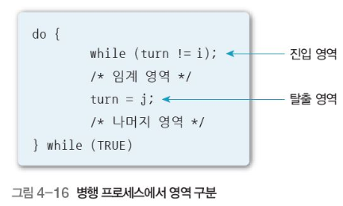
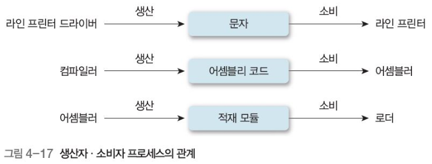
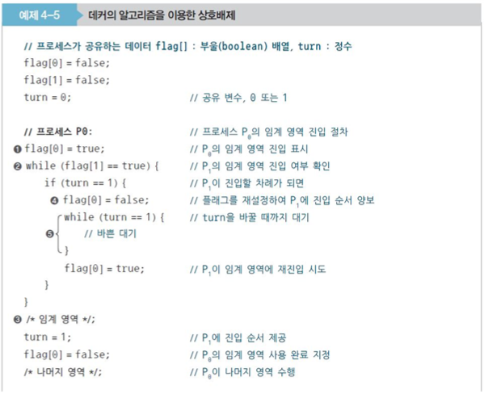
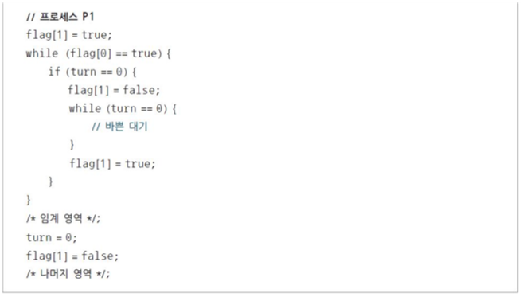

# 병행 프로세스와 상호배제

## 01 병행 프로세스

#### 병행 프로세스

- 운영체제가 프로세서를 빠르게 전환, 프로세서 시간 나눠 마치 프로세스 여러 개를 동시에 실행하는 것처럼 보이게 하는 것

#### 병행 프로세스 종류

##### 독립 프로세스

- 단일 처리 시스템에서 수행하는 병행 프로세스, 다른 프로세스에 영향 주고받지 않으면서 독립 실행
- 다른 프로세스, 데이터와 상태 공유 않고 동작도 재현 가능

##### 협력 프로세스

- 다른 프로세스와 상호작용하며 특정 기능 수행하는 비동기적 프로세스
- 간단한 예 : 두 프로세스의 동일한 파일 사용 시


## 02 상호배제와 동기화

#### 1. 상호배제(mutual exclusion)

- 병행 프로세스에서 프로세스 하나가 공유 자원 사용 시 다른 프로세스들이 동일한 일을 할 수 없도록 하는 방법
- 동기화 : 공유 자원을 동시에 사용하지 못하게 실행을 제어하는 방법 뜻 함. 
  - 동기화로 상호배제 보장할 수 있지만, 이 과정에서 교착 상태와 기아 상태가 발생할 수 있음
- 상호배제의 조건
  - 두 프로세스는 동시에 공유 자원에 진입 불가
  - 프로세스의 속도나 프로세서 수에 영향 받지 않음
  - 공유 자원을 사용하는 프로세스만 다른 프로세스 차단 가능
  - 프로세스가 공유 자원을 사용하려고 너무 오래 기다려서는 안 됨

#### 2. 임계영역

- 다수의 프로세스가 접근 가능하지만, 어느 한 순간에는 프로세스 하나만 사용 가능

##### 임계 영역 이용한 상호배제

- 간편하게 상호배제 구현 가능(자물쇠와 열쇠 관계)
  - 프로세스가 진입하지 못하는 임계영역 -> 자물쇠로 잠근 상태
- 어떤 프로세스가 열쇠 사용할 수 있는지 확인하려고 검사 하는 동작과 다른 프로세스 사용 긂지하는 동작으로 분류



##### 임계 영역의 조건

- 상호배제 : 어떤 프로세스가 임계 영역에서 작업 중, 다른 프로세스 임계 영역 진입 불가
- 진행 : 임계 영역에 프로세스가 없는 상태에서 어떤 프로세스가 들어갈지 결정
- 한정 대기 : 다른 프로세스가 임계 영역을 무한정 기다리는 상황 방지 위해 임계 영역에 한 번 들어갔던 프로세스는 다음에 임계 영역에 다시 들어갈 때 제한

#### 3. 생산자, 소비자 문제

##### 생산자, 소비자 문제

- 운영체제에서 비동기적으로 수행하는 모델
- 생산자 프로세스가 생산한 정보를 소비자 프로세스가 소비하는 형태
- 소비자가 데이터 받을 준비를 마칠 때까지 생산자는 버퍼로 데이터 전송



##### 경쟁 상태

- 여러 프로세스가 동시에 공유 데이터에 접근 시, 접근 순서에 따라 실행 결과 달라지는 상황 말함.
- 장치나 시스템이 둘 이상의 연산 동시 실행 시, 어느 프로세스를 마지막으로 수행한 후 결과를 저장했느냐에 따라 오류가 발생하므로 적절한 순서에 따라 수행 해야 함
- 경쟁 상태의 예방
  - 병행 프로세스들을 동기화해야 함(임계 영역 이용한 상호배제로 구현)


## 03 상호배제 방법

#### 데커 알고리즘

- 각 프로세스 플래그 설정 가능, 다른 프로세스 확인 후 플래그 재설정 가능
- 프로세스가 임예 영역에 진입하고 싶으면 플래그 설정하고 대기





- 임계영역 바깥에서 수행 중인 프로세스가 다른 프로세스들이 임계 영역 진입 막지 않음
- 임계 영역에 들어가기를 원하는 프로세서 무한정 기다리게 하지 않음 
- 그 외 알고리즘
  - 크누스 알고리즘, 다익스트라 알고리즘, 램포트의 베이커리(빵집) 알고리즘

#### TestAndSet(테스) 명령어

- 공유 변수를 수정하는 동안 인터럽트의 발생을 억제하여 임계 영역 문제 간단 해결
- 메모리 영역의 값에 대해 검사와 수정을 원자적으로 수행할 수 있는 하드웨어 명령어 
- 알고리즘이 간단, 하나의 메모리 사이클에서 수행하여 경쟁 상황 해결
- 바쁜 대기가 발생하고, 기아 상태, 교착 상태 발생 가능

```
boolean TestAndSet (boolean *target){
	boolean temp = *target; //이전 값 기록
	*target = true; 		//true로 설정
	return temp;			//값 반환
}

//lock을 사용한 상호배제
do
{
	while (TestAndSet(&lock))	//lock을 검사하여 true이면 대기, false이면 임계 영역 진입
		;
		//임계영역
	lock = false;				//다른 프로세스의 진입 허용 의미로 lock을 false로 
	//나머지 영역
}while(true);

//TestAndSet명령어를 이용한 상호배제
do
{
	waiting[i] = true;
}

```

