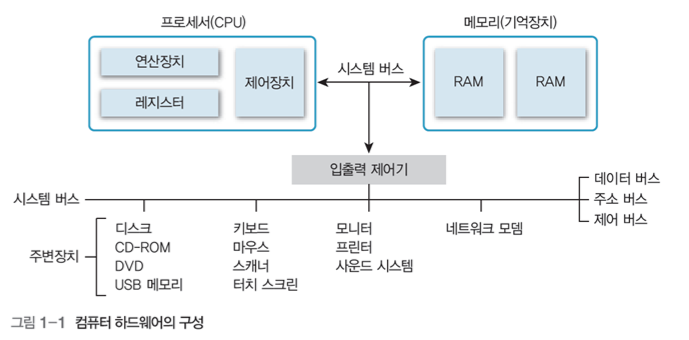
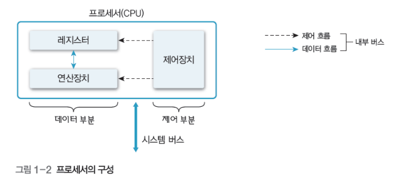
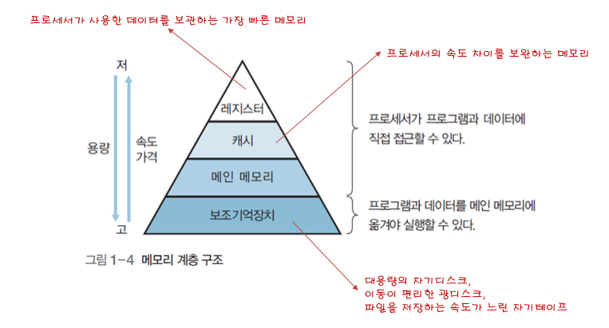
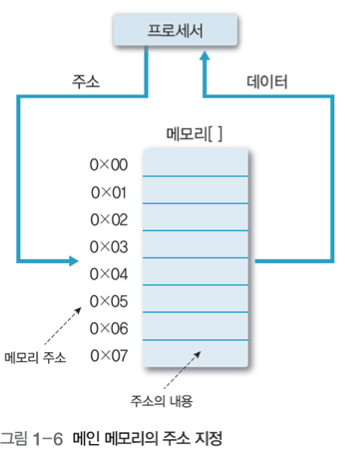
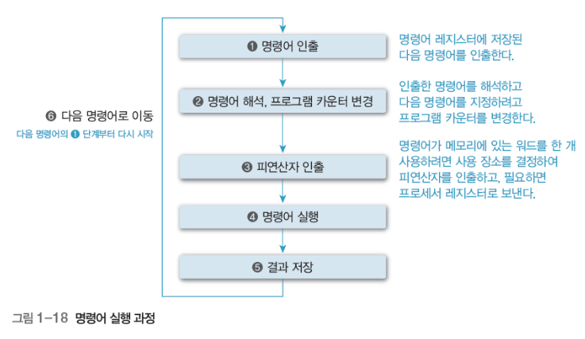

# 컴퓨터 시스템의 소개

## 01.컴퓨터 하드웨어의 구성

- 컴퓨터 시스템

  - 데이터를 처리하는 물리적인 기계장치인 하드웨어와 어떤 작업을 지시하는 명령어로 작성한 프로그램인 소프트웨어로 구성

- 컴퓨터 하드웨어

  - 하드웨어는 프로세서, 메모리(기억장치), 주변장치로 구성되고, 이들은 시스템 버스로 연결

  

### 1. 프로세서(CPU-중앙처리장치)

- 주요기능: 제어, 연산, 기억

- 제어장치 
  - 컴퓨터에 있는 모든 장치들의 동작을 지시하고 제어, 명령어를 해독해 해당하는 장치에게 제어 신호를 보내 수행
- 연산장치(ALU)
  - 제어장치의 명령을 받아 실제 연산을 수행하는 장치
  - 산술, 논리, 관계, 이동 등의 연산을 수행
- 레지스터
  - CPU내부에서 처리할 명령어나 연산의 중간 결과값 등을 일시적으로 기억하는 임시 기억장소
  - 메모리 중에서 가장 빠른 속도를 가짐

### 2. 메모리

- 메모리 계층 구조

- 캐시

  - 프로세서 내부나 외부에 있으며, 처리 속도가 빠른 프로세서와 상대적으로 느린 메인 메모리의 속도 차이를 보완하는 고속 버퍼
  - 메인 메모리에서 데이터를 블록 단위로 가져와 프로세서에 워드 단위로 전달하여 속도를 높임

- 메인 메모리

  - 프로세서 외부에 있으면서 프로세서에서 수행할 프로그램과 데이터를 저장하거나 프로세서에서 처리한 결과 저장
  
  - 주기억장치 또는 1차 기억장치라고도 한다. 저장 밀도가 높고 가격이 싼 DRAM을 많이 사용
  
  - 프로세서 <-------> 메인메모리 <-------> 주변장치
    
  - 다수의 셀로 구성되며, 각 셀은 비트로 구성.
  
  - 데이터를 저장할 때, 셀 한 개나 여러 개에 나눠서 저장
  
  - 셀은 주소로 참조하는데, n비트라면 주소 범위는 0~2^(n-1)
  
    
  
  - 메모리 매핑(사상)
  
    - 컴파일로 논리적 주소를 물리적 주소로 변환하는 과정
    - 프로그래밍으로 생성된 가상 주소(논리적 주소) ---------(매핑)--------> 실제 주소(물리적 주소)
  
- 보조기억장치

  - 주변장치 중 프로그램과 데이터를 저장하는 하드웨어

### 3. 시스템 버스

- 하드웨어를 물리적으로 연결하여 서로 데이터를 주고 받을 수 있게 하 는 통로
- 데이터 버스
  - 데이터를 전송
  - 데이터 버스를 구성하는 배선 수==프로세서가 한번에 전송할 수 있는 비트 수==워드
- 주소 버스
  - 프로세서가 시스템의 구성 요소를 식별하는 주소 정보를 전송
  - 주소 버스를 구성하는 배선 수==프로세서와 접속할 수 있는 메인 메모리의 최대 용량
- 제어 버스
  - 프로세서가 시스템의 구성 요소를 제어하는 데 사용

## 02 컴퓨터 시스템의 동작

- 컴퓨터 시스템의 작업 처리 순서 
  1. 입력장치로 정보를 입력받아 메모리에 저장
  2. 메모리에 저장한 정보를 프로그램 제어에 따라 인출하여 연산장치에서 처리
  3. 처리한 정보를 출력장치에 표시하거나 보조기억장치에 저장
- 명령어의 실행과정

